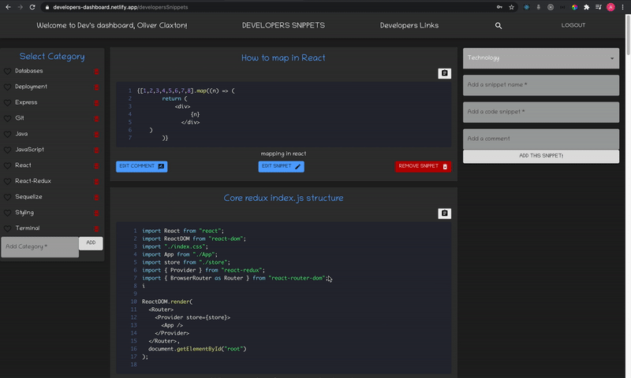

Developers Dashboard is a platform for developers to store code snippets and links to essential resources. This project was realized in 5 days by a group of 3 Codaisseur students. There weren't any hard requirements for this project, the only guideline we've received was related to the generic theme: useful things we would've liked to have during the Codaisseur bootcamp.

## Snapshots

  
 

  

## Used technologies

- React 
- React Router 
- React Sticky Box 
- React Syntax Highlighter
- Redux 
- Axios 
- Material-UI 
- Express  
- PostgreSQL
- Sequelize ORM 
